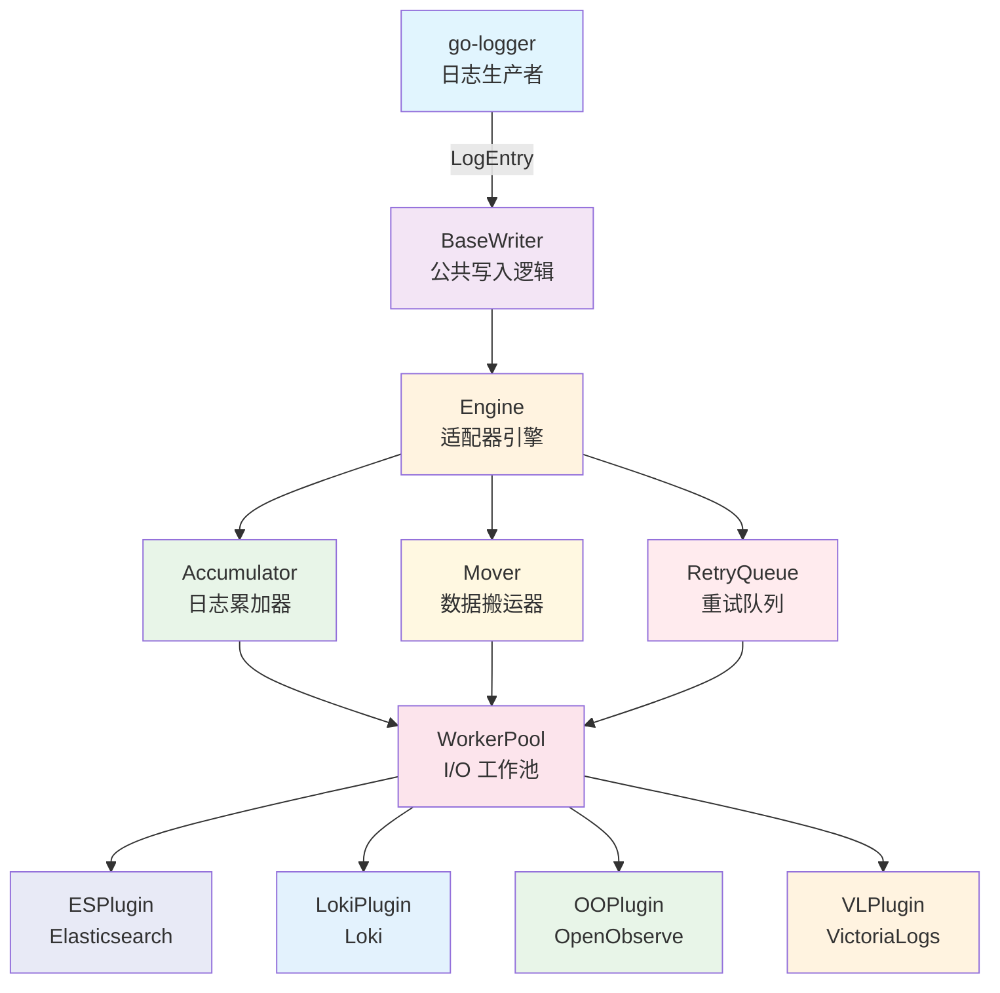

# Go Logger Adapter - 企业级日志适配器框架

> 一个高性能的日志适配器框架，为 `go-logger` 提供多种日志后端的统一接入能力
> 通过插件化架构，支持 Elasticsearch、Loki、OpenObserve、VictoriaLogs 等主流日志系统，内置批处理、压缩、重试和背压控制等企业级特性

[](https://github.com/kamalyes/go-logger-adapter)
[]()
[]()
[]()
[]()
[]()
[]()
[]()
[]()
[]()
[]()
[]()
[](https://goreportcard.com/report/github.com/kamalyes/go-logger-adapter)
[](https://pkg.go.dev/github.com/kamalyes/go-logger-adapter?tab=doc)

## 🚀 为什么选择 go-logger-adapter？

### ⚡ 核心特性

- **🔌 插件化架构**: 统一的 Plugin 接口，轻松扩展新的日志后端
- **📦 批处理引擎**: 自动聚合日志条目，按大小或时间触发批量发送
- **🔄 智能重试**: 指数退避重试机制，可配置不重试的 HTTP 状态码
- **🗜️ 数据压缩**: 支持 Gzip/Zlib 压缩，减少网络传输开销
- **🛡️ 背压控制**: 内存限制 + 阻塞等待，防止 OOM
- **📊 统计信息**: 实时统计发送成功/失败/重试/丢弃次数
- **🔐 统一认证**: 支持 Basic/API Key/Bearer Token/自定义 Token 认证
- **⚡ 高性能**: 基于 go-toolbox WorkerPool 的并发发送
- **🧩 零重复**: BaseWriter 消除各插件重复代码

### 支持的日志后端

| 后端            | 包路径                              | 说明                            |
| ------------- | -------------------------------- | ----------------------------- |
| Elasticsearch | `go-logger-adapter/es`           | 通过 Bulk API 写入 ES             |
| Loki          | `go-logger-adapter/loki`         | 通过 Push API 写入 Loki           |
| OpenObserve   | `go-logger-adapter/openobserve`  | 通过 Ingest API 写入 OpenObserve  |
| VictoriaLogs  | `go-logger-adapter/victorialogs` | 通过 Insert API 写入 VictoriaLogs |

## 🏗️ 架构设计



### 核心组件

| 组件           | 文件                | 说明                                        |
| ------------ | ----------------- | ----------------------------------------- |
| Engine       | `engine.go`       | 适配器引擎，协调各组件完成日志的批处理、压缩、发送和重试              |
| BaseWriter   | `base_writer.go`  | 基础写入器，各插件嵌入复用 Start/Flush/Close/Write 等方法 |
| Accumulator  | `batcher.go`      | 日志累加器，收集日志并组织成批次                          |
| Mover        | `mover.go`        | 数据搬运器，定时将过期批次和重试批次提交到工作池                  |
| WorkerPool   | `pool.go`         | I/O 工作池，管理并发发送任务                          |
| RetryQueue   | `retry.go`        | 重试队列，基于最小堆按重试时间排序                         |
| BackPressure | `backpressure.go` | 背压控制器，防止内存溢出                              |
| Compressor   | `compressor.go`   | 数据压缩器，支持 Gzip/Zlib                        |
| Stats        | `stats.go`        | 统计信息收集器，使用 atomic 优化并发性能                  |
| Plugin       | `plugin.go`       | 插件接口定义                                    |
| AuthConfig   | `auth.go`         | 统一认证配置                                    |
| FormatUtils  | `format.go`       | 日志条目格式化工具                                 |

## 📦 快速开始

### 环境要求

建议需要 [Go](https://go.dev/) 版本 [1.20](https://go.dev/doc/devel/release#go1.20.0) 或更高版本

### 安装

```sh
go get -u github.com/kamalyes/go-logger-adapter
```

## 🚀 适配器使用示例

- [📘 Elasticsearch 适配器](./es/README.md)
- [📗 Loki 适配器](./loki/README.md)
- [📙 OpenObserve 适配器](./openobserve/README.md)
- [📕 VictoriaLogs 适配器](./victorialogs/README.md)

## 🔧 通用引擎配置

所有适配器共享以下通用配置（通过 `adapter.Config` 设置）：

| 配置项                  | 类型                | 默认值         | 说明            |
| -------------------- | ----------------- | ----------- | ------------- |
| `MaxBatchSize`       | `int64`           | 512KB       | 单个批次最大字节数     |
| `MaxBatchCount`      | `int`             | 4096        | 单个批次最大条目数     |
| `LingerMs`           | `int64`           | 2000        | 批次等待时间（毫秒）    |
| `MaxRetries`         | `int64`           | 10          | 最大重试次数        |
| `BaseRetryMs`        | `int64`           | 100         | 基础重试间隔（毫秒）    |
| `MaxRetryMs`         | `int64`           | 50000       | 最大重试间隔（毫秒）    |
| `MaxIoWorkers`       | `int64`           | 50          | I/O 工作协程数     |
| `TotalSizeLimit`     | `int64`           | 100MB       | 内存总量限制（字节）    |
| `MaxBlockSec`        | `int64`           | 60          | 背压最大阻塞时间（秒）   |
| `NoRetryStatusCodes` | `[]int`           | \[400, 404] | 不重试的 HTTP 状态码 |
| `Compression`        | `CompressionType` | None        | 压缩类型          |
| `RequestTimeout`     | `time.Duration`   | 30s         | 请求超时时间        |
| `FlushInterval`      | `time.Duration`   | 5s          | 刷新间隔          |

## 🔌 自定义插件

实现 `adapter.Plugin` 接口即可创建自定义日志后端适配器：

```go
package myadapter

import (
 "context"
 "github.com/kamalyes/go-logger-adapter"
)

type MyPlugin struct {
 config *MyConfig
}

func (p *MyPlugin) Name() string { return "my-adapter" }

func (p *MyPlugin) Format(entries []adapter.LogEntry) ([]byte, error) {
 return adapter.MarshalEntryToJSON(&entries[0], "timestamp"), nil
}

func (p *MyPlugin) Send(ctx context.Context, body []byte, headers map[string]string) error {
 return nil
}

func (p *MyPlugin) HealthCheck(ctx context.Context) error {
 return nil
}

type Writer struct {
 *adapter.BaseWriter
}

func NewWriter(config *MyConfig) (*Writer, error) {
 plugin := &MyPlugin{config: config}
 opts := adapter.CommonAdapterOpts(config.Common)
 engine, err := adapter.NewEngine(plugin, opts...)
 if err != nil {
  return nil, err
 }
 return &Writer{BaseWriter: adapter.NewBaseWriter(engine)}, nil
}
```

## 🤝 社区贡献

我们欢迎各种形式的贡献！请遵循以下指南：

### 提交代码

1. **Fork 项目**

```bash
git clone https://github.com/kamalyes/go-logger-adapter.git
cd go-logger-adapter
```

1. **创建特性分支**

```bash
git checkout -b feature/your-amazing-feature
```

1. **编写代码和测试**

- 确保新功能有完整的测试套件
- 运行 `go test ./...` 确保所有测试通过
- 保持代码覆盖率 > 90%

1. **提交更改**

```bash
git commit -m 'feat: add amazing new feature'
```

1. **推送并创建 Pull Request**

```bash
git push origin feature/your-amazing-feature
```

### 代码规范

- 遵循 Go 官方代码风格
- 使用有意义的函数和变量名
- 添加必要的注释和文档（遵循 go-logger 注释风格）
- 使用测试套件编写测试
- 确保并发安全

### 测试要求

- 新功能必须有对应的测试套件
- 测试覆盖率不得低于当前水平
- 包含性能基准测试（如适用）
- 验证并发安全性

## ⭐ Star 历史

[](https://star-history.com/#kamalyes/go-logger-adapter\&Date)

## 许可证

该项目使用 MIT 许可证，详见 [LICENSE](LICENSE) 文
